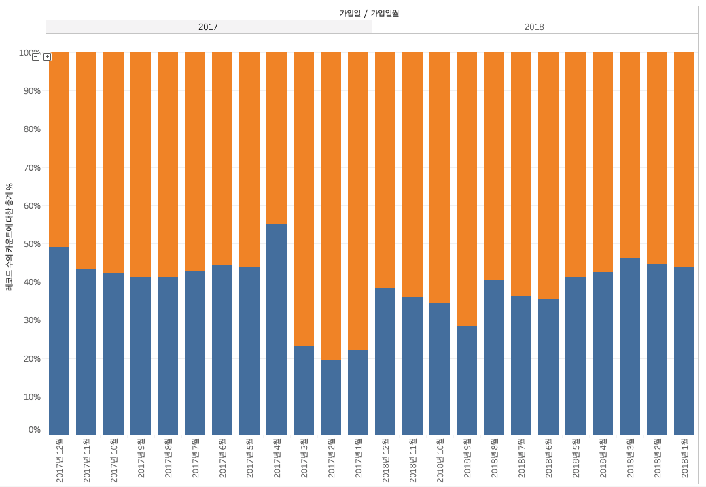
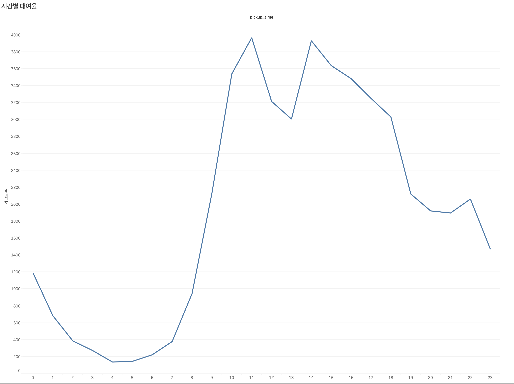
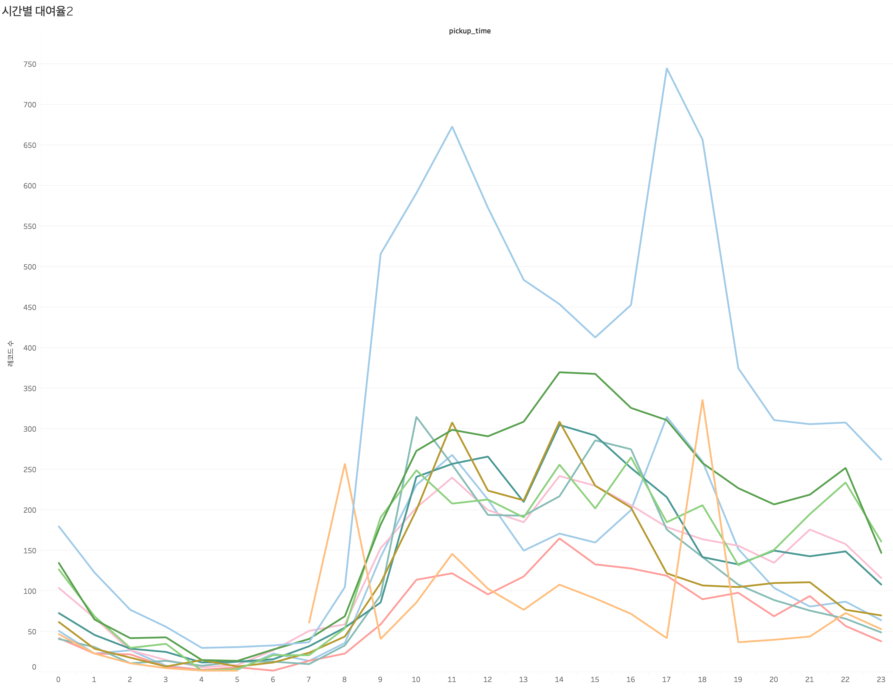
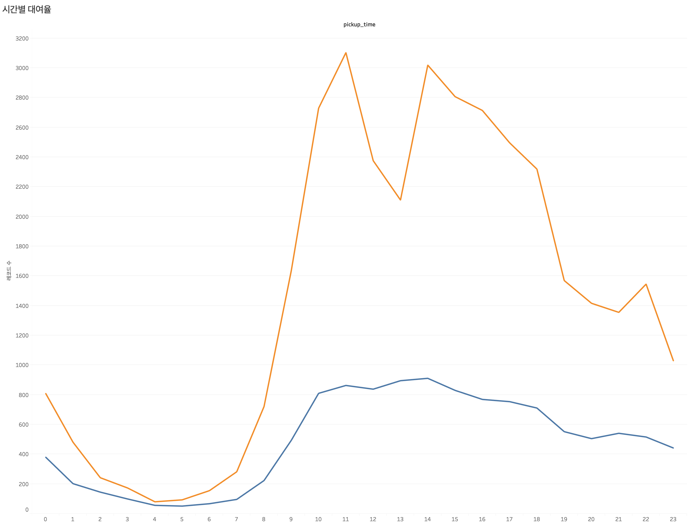

dump table

| 필드 이름 | 유형 |
|:---|:---|
| id  | INTEGER  |
| created  | TIMESTAMP  |
| updated  | TIMESTAMP  |
| deleted  | TIMESTAMP  |
| status  | INTEGER  |
| pickup_time  | TIMESTAMP  |
| return_time  | TIMESTAMP  |
| options  | INTEGER  |
| purpose  | STRING  |
| car_id  | INTEGER  |
| exemption_id  | STRING  |
| paycard_id  | STRING  |
| pickup_spot_id  | INTEGER  |
| return_spot_id  | INTEGER  |
| user_id  | INTEGER  |
|----

1. MAU(Monthly Active User)

```SQL
SELECT COUNT(DISTINCT user_id)
FROM `carsharing_data.dump`
WHERE pickup_time >= '2019-02-01' and pickup_time <= '2019-02-28'
```
2. DAU(Daily Active User)
3. 일자별 Trip의 수
4. 스팟별 Trip의 수
5. 시작 Station, 도착 Station 별 개수
6. Trip을 시작하는 특정 날짜 및 시간에 대한 Count
7. 2019년 1월 1일부터 시간대별 추세

```SQL
SELECT start_hour, count(id) AS count
FROM (
	SELECT DATETIME_TRUNC(DATETIME(pickup_time), hour) AS start_hour, *
	FROM `carsharing_data.dump`
	where date(pickup_time) >= '2019-01-01'
)
GROUP BY start_hour
ORDER BY count DESC
```

8. 요일별 사용자 수 Count


### Tableau Visualization

## Proportion of customers


## Peaks



## Peaks Weekdays Or weekends
