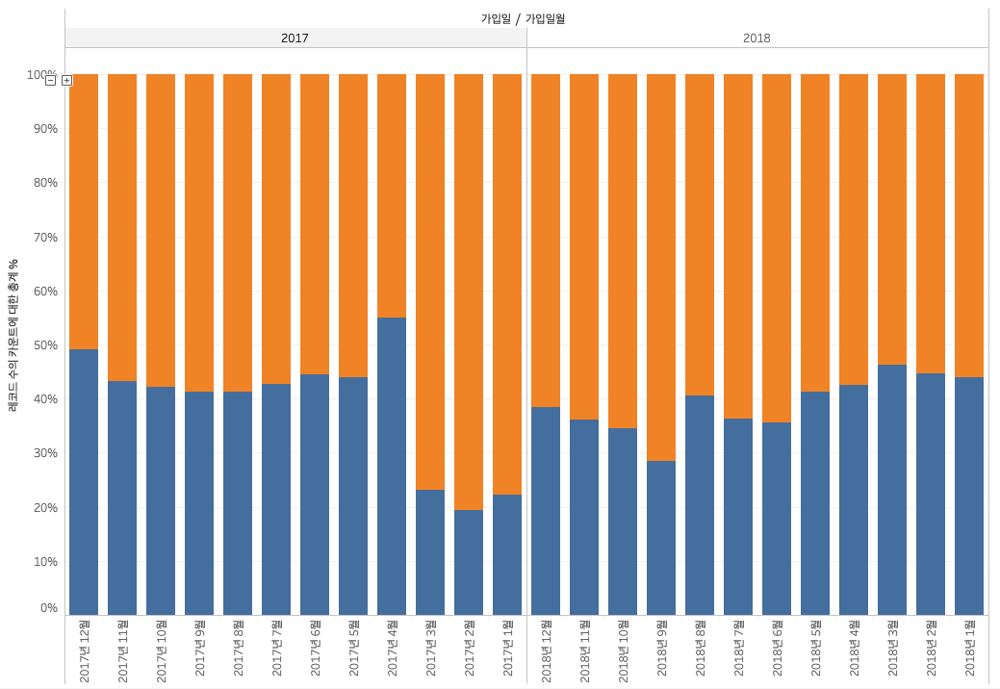
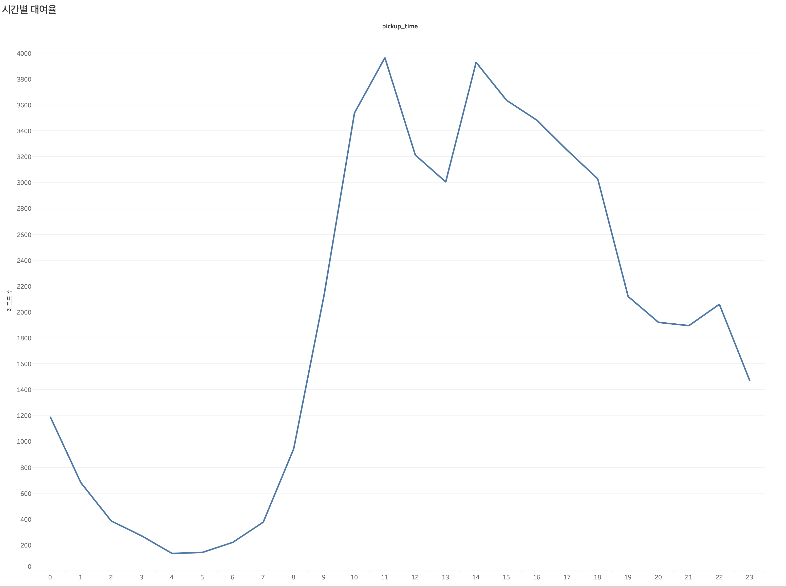

1. 일자별 Trip의 수
2. 스팟별 Trip의 수
3. 시작 Station, 도착 Station 별 개수
4. Trip을 시작하는 특정 날짜 및 시간에 대한 Count
5. 2019년 1월 1일부터 시간대별 추세
6. 요일별 사용자 수 Count


Table: dump table

| 필드 이름 | 유형 |
|:---|:---|
| id  | INTEGER  |
| created  | TIMESTAMP  |
| updated  | TIMESTAMP  |
| deleted  | TIMESTAMP  |
| status  | INTEGER  |
| pickup_time  | TIMESTAMP  |
| return_time  | TIMESTAMP  |
| options  | INTEGER  |
| purpose  | STRING  |
| car_id  | INTEGER  |
| exemption_id  | STRING  |
| paycard_id  | STRING  |
| pickup_spot_id  | INTEGER  |
| return_spot_id  | INTEGER  |
| user_id  | INTEGER  |
|----

#### 1. 일자별 Trip의 수

```sql
SELECT DATE(pickup_time), COUNT(id) as count
FROM carsharing_data.dump
GROUP BY date
ORDER BY date;
```

#### 2. 스팟별 Trip의 수

```sql
SELECT pickup_spot_id, COUNT(id) as count
FROM carsharing_data.dump
GROUP BY prickup_spot_id
ORDER BY count DESC;
```

#### 3. 시작 Station, 도착 Station 별 카운트

```sql
SELECT pickup_spot_id, return_spot_id, count(id) as trip_cnt
FROM carsharing_data.dump
GROUP BY pickup_spot_id, return_spot_id
ORDER BY trip_ctn DESC;
```

#### 4. Trip을 시작하는 특정 날짜 및 시간에 대한 카운트

```sql
SELECT start_hour, count(id) AS count
FROM (
    SELECT EXTRACT(hour FROM pickup_time) AS start_hour, *
    FROM carsharing_data.dump
)
GROUP BY start_hour
ORDER BY count DESC
```

#### 5. Trip을 시작하는 특정 날찌 및 시간에 대한 카운트 

```sql
SELECT start_hour, count(id) AS count
FROM (
    SELECT DATETIME_TRUNC(DATETIME(pickup_time), hour) AS start_hour, *
    FROM carsharing_data.dump
)
GROUP BY start_hour
ORDER BY count DESC
```

> DATETIME_TRUNC(datetime_expression, part)  
> `DATETIME` 객체를 `PART` 단위로 자르며 아래의 `part` 값을 지원
- `MICROSECOND`, `MILLISECOND`
- `SECOND`, `MINUTE`, `HOUR`, `DAY`, `WEEK`, `MONTH`, `YEAR`

```sql
SELECT 
    DATETIME "2008-12-25 15:30:00" AS original,
    DATETIME_TRUNC(DATETIME "2008-12-25 15:30:00", DAY) AS truncated;
```

| original            | truncated           |
|---------------------|---------------------|
| 2008-12-25 15:30:00 | 2008-12-25 00:00:00 |


### Tableau Visualization

#### Proportion of customers


#### Peaks



#### Peaks Weekdays Or weekends
