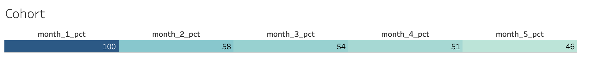

Table: dump table

| 필드 이름 | 유형 |
|:---|:---|
| id  | INTEGER  |
| created  | TIMESTAMP  |
| updated  | TIMESTAMP  |
| deleted  | TIMESTAMP  |
| status  | INTEGER  |
| pickup_time  | TIMESTAMP  |
| return_time  | TIMESTAMP  |
| options  | INTEGER  |
| purpose  | STRING  |
| car_id  | INTEGER  |
| exemption_id  | STRING  |
| paycard_id  | STRING  |
| pickup_spot_id  | INTEGER  |
| return_spot_id  | INTEGER  |
| user_id  | INTEGER  |
|----

##### 전체 대여 횟수 및 이용자 확인

```sql
SELECT COUNT(id), COUNT(DISTINCT user_id)
FROM `carsharing-256705.carsharing.dump`
```

|   | count | user_count |
|---|-------|------------|
| 1 | 47011 | 2875       |

##### Subquery를 이용한 방법

```sql
SELECT COUNT(DISTINCT user_id)
FROM `carsharing-256705.carsharing.dump`
WHERE user_id IN (SELECT DISTINCT user_id FROM `carsharing-256705.carsharing.dump` WHERE pickup_time BETWEEN '2018-01-01' AND '2018-01-31')
    AND pickup_time BETWEEN '2018-02-01' AND '2018-02-28'
```


##### WITH 구문을 이용한 방법

```sql
WITH month_1_user AS (
  SELECT DISTINCT user_id
  FROM `carsharing-256705.carsharing.dump`
  WHERE date(pickup_time, 'Asia/Seoul') BETWEEN '2018-01-01' AND '2018-01-30'
) ,
month_2_user AS (
  SELECT DISTINCT user_id
  FROM `carsharing-256705.carsharing.dump`
  WHERE date(pickup_time, 'Asia/Seoul') BETWEEN '2018-02-01' AND '2018-02-28'
),
month_3_user AS (
  SELECT DISTINCT user_id
  FROM `carsharing-256705.carsharing.dump`
  WHERE date(pickup_time, 'Asia/Seoul') BETWEEN '2018-03-01' AND '2018-03-30'
),
month_4_user AS (
  SELECT DISTINCT user_id
  FROM `carsharing-256705.carsharing.dump`
  WHERE date(pickup_time, 'Asia/Seoul') BETWEEN '2018-04-01' AND '2018-04-30'
),
month_5_user AS (
  SELECT DISTINCT user_id
  FROM `carsharing-256705.carsharing.dump`
  WHERE date(pickup_time, 'Asia/Seoul') BETWEEN '2018-05-01' AND '2018-05-30'
),
month_6_user AS (
  SELECT DISTINCT user_id
  FROM `carsharing-256705.carsharing.dump`
  WHERE date(pickup_time, 'Asia/Seoul') BETWEEN '2018-06-01' AND '2018-06-28'
)
SELECT 
  (SELECT count(*) 
   FROM month_1_user) AS month_1_cohort,
  (SELECT count(*)
   FROM month_1_user
   JOIN month_2_user USING (user_id)) AS month_2_cohort,
  (SELECT count(*)
   FROM month_1_user
   JOIN month_3_user USING (user_id)) AS month_3_cohort,
  (SELECT count(*)
   FROM month_1_user
   JOIN month_4_user USING (user_id)) AS month_4_cohort,
  (SELECT count(*)
   FROM month_1_user
   JOIN month_5_user USING (user_id)) AS month_5_cohort
   ```

|   | month_1_cohort | month_2_cohort | month_3_cohort | month_4_cohort | month_5_cohort |
|---|----------------|----------------|----------------|----------------|----------------|
| 1 | 373            | 216            | 200            | 190            | 170            |


##### Cohort Percentage 구하기

   ```sql
SELECT
  ROUND(month_1_cohort / month_1_cohort * 100) AS month_1_pct,
  ROUND(month_2_cohort / month_1_cohort * 100) AS month_2_pct,
  ROUND(month_3_cohort / month_1_cohort * 100) AS month_3_pct,
  ROUND(month_4_cohort / month_1_cohort * 100) AS month_4_pct,
  ROUND(month_5_cohort / month_1_cohort * 100) AS month_5_pct
 FROM (
  WITH month_1_user AS (
    SELECT DISTINCT user_id
    FROM `carsharing-256705.carsharing.dump`
    WHERE date(pickup_time, 'Asia/Seoul') BETWEEN '2018-01-01' AND '2018-01-30'
  ) ,
  month_2_user AS (
    SELECT DISTINCT user_id
    FROM `carsharing-256705.carsharing.dump`
    WHERE date(pickup_time, 'Asia/Seoul') BETWEEN '2018-02-01' AND '2018-02-28'
  ),
  month_3_user AS (
    SELECT DISTINCT user_id
    FROM `carsharing-256705.carsharing.dump`
    WHERE date(pickup_time, 'Asia/Seoul') BETWEEN '2018-03-01' AND '2018-03-30'
  ),
  month_4_user AS (
    SELECT DISTINCT user_id
    FROM `carsharing-256705.carsharing.dump`
    WHERE date(pickup_time, 'Asia/Seoul') BETWEEN '2018-04-01' AND '2018-04-30'
  ),
  month_5_user AS (
    SELECT DISTINCT user_id
    FROM `carsharing-256705.carsharing.dump`
    WHERE date(pickup_time, 'Asia/Seoul') BETWEEN '2018-05-01' AND '2018-05-30'
  ),
  month_6_user AS (
    SELECT DISTINCT user_id
    FROM `carsharing-256705.carsharing.dump`
    WHERE date(pickup_time, 'Asia/Seoul') BETWEEN '2018-06-01' AND '2018-06-28'
  )
  SELECT 
    (SELECT count(*) 
     FROM month_1_user) AS month_1_cohort,
    (SELECT count(*)
     FROM month_1_user
     JOIN month_2_user USING (user_id)) AS month_2_cohort,
    (SELECT count(*)
     FROM month_1_user
     JOIN month_3_user USING (user_id)) AS month_3_cohort,
    (SELECT count(*)
     FROM month_1_user
     JOIN month_4_user USING (user_id)) AS month_4_cohort,
    (SELECT count(*)
     FROM month_1_user
     JOIN month_5_user USING (user_id)) AS month_5_cohort
     )
```

|   | month_1_pct | month_2_pct | month_3_pct | month_4_pct | month_5_pct |
|---|-------------|-------------|-------------|-------------|-------------|
| 1 | 100.0       | 58.0        | 54.0        | 51.0        | 46.0        |


##### Tabluea로 표현한 Cohort 
