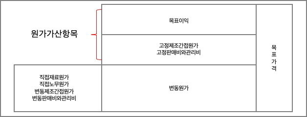
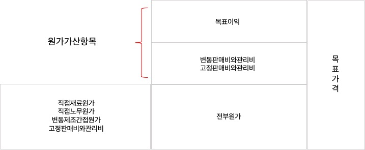
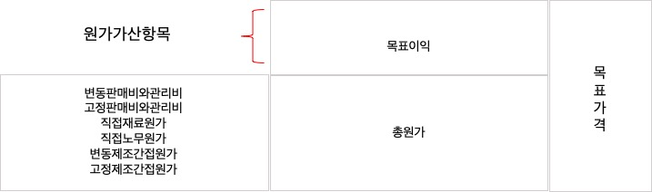

#### 제품가격결정
가격결정은 기업활동의 모든 측면에 대한 결정으로 기업전체에 영향을 미치기 때문에 단일사안으로 가장 중요한 의사결정으로 간주된다. 제품의 가격은 고객이 매입하고자 하는 수량을 결정하는 요소이므로, 가격결정은 기업의 수익흐름을 지배하게 된다. 가격결정에 영향일 미치는 주요한 요소는 `고객`, `경쟁기업`, `원가`가 있다. 원가의 경우 원가에 비하여 너무 높게 책정한 제품은 합리적인 가격일 경우에 판매될 수 있는 수량보다 적게 판대됨으로써 기업에 손해를 입힐 수 있다. 따라서 제품의 가격을 결정할 때는 제품의 원가행태를 적절히 반영해야 한다.

##### 경제학적 가격결정모형
경제학에서는 수익과 비용의 차이가 가장 크게 되는 점, 즉 한계수익과 한계비용이 일치하는 점에서 기업의 이익이 극대화된다고 가정. 따라서 제품의 최적판매가격은 한계수익과 한계비용이 일치하는 점에서 결정.
- MR = dTR / dQ
- MC = dTC / dQ
- TR = 총수익, TC = 총비용, Q = 판매량, MR = 한계수익, MC = 한계비용

##### 회계학적 가격결정방법
원가가산 가격결정방법(cost-based pricing)이라고도 하며, 제품에 대해 장기적인 정상가격을 결정할 때는 모든 원가가 가격결정에 관련되므로, 고정원가(매몰원가 포함)도 변동원가와 함께 고려되어야 하며 판매비및관리비도 제조원가와 함께 가격에 반영되어야 한다. 실무에서는 일정 형태의 원가가산 가격결정공식을 적용.

###### 공헌이익접근법
공헌이익접근법은 원가를 행태에 따라 변동원가와 고정원가로 분류하여 변동원가만을 기초로 가격을 설정하는데, 변동원가에는 변동제조원가 및 변동판매비와관리비도 포함 
- 원가가산율 = 원가가산항목 / 기준원가
- 공헌이익접근법에 의한 원가가산율 = (고정원가 + 목표이익) / 변동원가

아래와 같이 고정제조간접원가와 고정판매비와관리비를 회수하고 적정이익을 얻을 수 있도록 가격을 설정해야 함 
{: .center-image}
---
###### 전부원가접근법
전부원가접근법은 장기이익과 관련된 가격결정방법으로, 고정제조간접원가를 포함한 제품생산에 투입되는 모든 제조원가를 기준으로 제품가격을 결정하는 방법
- 원가가산율 = (판매비와관리비 + 목표이익) / 전부원가
아래와 같이 판매비와관리비를 원가부분에서 고려하는 것이 아니라 원가가산항목으로 포함시키고 적정이익을 얻을 수 있도록 가격을 설정
{: .center-image}
---

###### 총원가접근법
총원가접근법은 파매비와관리비를 포함한 제품 생산 및 판매, 일반관리활동에 투입된 모든 원가를 기준으로 제품가격을 결정하는 방법
- 원가가산율 = 목표이익 / 총원가
총원가접근법에서의 원가가산항목은 목표이익뿐이며 아래와 같이 판매비와관리비를 포함한 모든 원가를 기준원가에 포함시키고 원가가산항목은 목표이익만을 고려함  
{: .center-image}
---
###### 목표가격결정방법

##### 특별가격결정

###### 신제품의 가격결정
- 상층흡수가격
- 시장침투가격

###### 입찰가격

###### 약탈적 가격정책