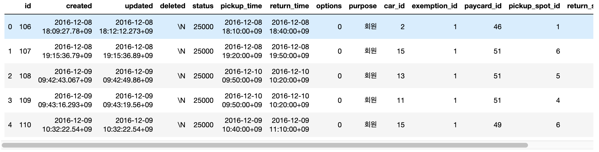
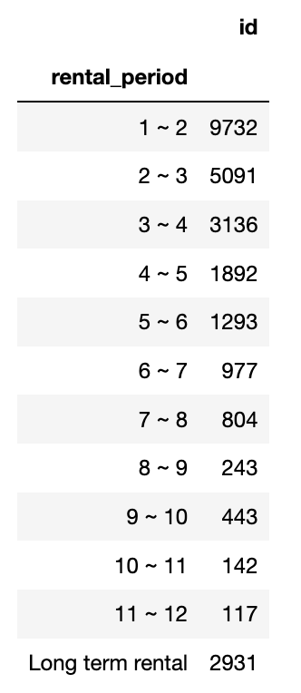
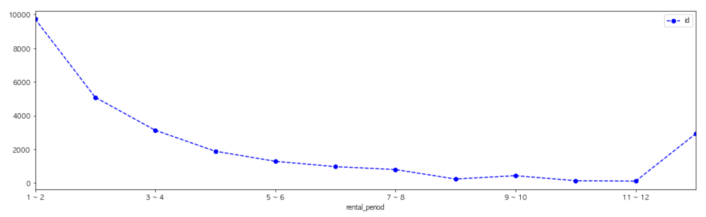

```python
import pandas as pd
import matplotlib.pyplot as plt
import seaborn as sns

plt.rcParams["font.family"] = 'AppleGothic'

raw_data = pd.read_csv("dump.csv")
print(raw_data.shape)
raw_data.head()
```



```python
raw_data["pickup_time"] = pd.to_datetime(raw_data["pickup_time"])
raw_data["return_time"] = pd.to_datetime(raw_data["return_time"])
```

날짜나 시간의 간격을 구할 때는 두 개의 `datetime.datetime` 클래스 객체의 차이를 구한다. 이 결과는 `datetime.timedelta` 클래스 객체로 반환된다. `datetime.timedelta` 클래스는 `total_seconds()` 메서드를 가진다. 

```python
raw_data["rental_period(clean)"] = raw_data["return_time"] - raw_data["pickup_time"]
raw_data["rental_period(secondes)"] = raw_data["rental_period(clean)"].dt.total_seconds()
```

```python
raw_data["rental_period(minutes)"] = raw_data["rental_period(secondes)"] / 60
print(raw_data["rental_period(minutes)"].shape)
raw_data["rental_period(minutes)"]
```

```python
def separate_period(rows):
    if rows <= 60 : 
        return "0 ~ 1"
    elif rows > 60 and rows <= 120:
        return "1 ~ 2"
    elif rows > 120 and rows <= 180:
        return "2 ~ 3"
    elif rows > 180 and rows <= 240:
        return "3 ~ 4"
    elif rows > 240 and rows <= 300:
        return "4 ~ 5"
    elif rows > 300 and rows <= 360:
        return "5 ~ 6"
    elif rows > 360 and rows <= 420:
        return "6 ~ 7"
    elif rows > 420 and rows <= 480:
        return "7 ~ 8"
    elif rows > 480 and rows <= 540:
        return "8 ~ 9"
    elif rows > 540 and rows <= 600:
        return "9 ~ 10"
    elif rows > 600 and rows <= 660:
        return "10 ~ 11"
    elif rows > 660 and rows <= 720:
        return "11 ~ 12"
    elif rows > 720: 
        return "Long term rental"
```

```python
raw_ata["rental_period"] = raw_data["rental_housr(minutes)"] .apply(separate_period)
```

```python
table = pd.pivot_table(raw_data, index = "rental_period", values = "id", aggfunc = "count")
```

```python
table_rows = ["1 ~ 2", "2 ~ 3", "3 ~ 4", "4 ~ 5", "5 ~ 6", "6 ~ 7", "7 ~ 8", "8 ~ 9", "9 ~ 10", "10 ~ 11", "11 ~ 12", "Long term rental" ]
table = table.loc[table_rows]
```



```python
table.plot(kind = "line", figsize = [18, 5], color = 'blue', marker = 'o', linestyle = 'dashed')
```

