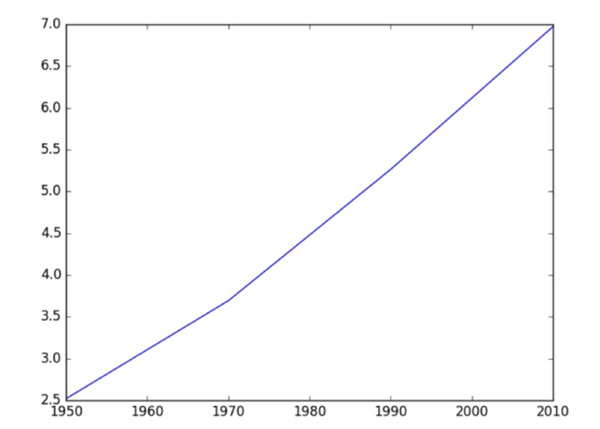

#### Data Visualization
- Very important in Data Analysis
  - Exlore data
  - Report insights

```sql
import matplotlib.pyplot as plt

year = [1950, 1970, 1990, 2010]
pop = [2.519, 3.692, 5.263, 6.972]

plt.plot(year, pop)
plt.show()
```

{: .center-image}

#### Scatter plot

```sql
import matplotlib.pyplot as plt

year = [1950, 1970, 1990, 2010]
pop = [2.519, 3.692, 5.263, 6.972]

plt.scatter(year, pop)
plt.show()
```
{: .center-image}

#### Histogram
- Explore dataset
- Get idea about distribution

{: .center-image}

{: .center-image}

```python
import matplotlib.pyplot as plt

values = [0, 0.6, 1.4, 1.6, 2.2, 2.5, 2.6, 3.2, 3.5, 3.9, 4.2, 6]
plt.his(values, bins = 3)
plt.show()
```
{: .center-image}

#### Histogram: bins
To control the number of bins to divide your data in, you can set the `bins` argument  
The number of bins is pretty important. Too few bins will oversimplify reality and won't show you the details. Too many bins will overcomplicate reality and won't show the bigger picture.

```python
plt.his(life_exp, bins = 20)
plt.show()
```

{: .center-image}

#### Labels
To axis labels and title with xlabel(), ylabel(), title()

```python
plt.scatter(gdp_cap, life_exp)
plt.xscale('log')

xlab = 'GDP per Capita [in USD]'
ylab = 'Life Expectancy [in years]'
title = 'World Development in 2007'

plt.xlabel(xlab)
plt.ylabel(ylab)
plt.title(title)

plt.show()
```


{: .center-image}

#### Ticks

```python
# Scatter plot
plt.scatter(gdp_cap, life_exp)

# Previous customizations
plt.xscale('log') 
plt.xlabel('GDP per Capita [in USD]')
plt.ylabel('Life Expectancy [in years]')
plt.title('World Development in 2007')

# Definition of tick_val and tick_lab
tick_val = [1000, 10000, 100000]
tick_lab = ['1k', '10k', '100k']

# Adapt the ticks on the x-axis
plt.xticks(tick_val, tick_lab)

# After customizing, display the plot
plt.show()
```

{: .center-image}

#### Size
pop contains population number for each country expressed in millions  
The argument `s` for size inside `plt.scatter()` changes size of the dots(corresponds to the population)

```python 
# Import numpy as np
import numpy as np

# Store pop as a numpy array: np_pop
np_pop = np.array(pop)

# Double np_pop
np_pop = np_pop * 2

# Update: set s argument to np_pop
plt.scatter(gdp_cap, life_exp, s = np_pop)

# Previous customizations
plt.xscale('log') 
plt.xlabel('GDP per Capita [in USD]')
plt.ylabel('Life Expectancy [in years]')
plt.title('World Development in 2007')
plt.xticks([1000, 10000, 100000],['1k', '10k', '100k'])

# Display the plot
plt.show()
```

{: .center-image}


#### Colors
A dictionary is constructed that maps continents onto colors:

```python
dict = {
    'Asia':'red',
    'Europe':'green',
    'Africa':'blue',
    'Americas':'yellow',
    'Oceania':'black'
}
```

```python
# Specify c and alpha inside plt.scatter()
plt.scatter(x = gdp_cap, y = life_exp, s = np.array(pop) * 2, alpha = 0.8, c = col)

# Previous customizations
plt.xscale('log') 
plt.xlabel('GDP per Capita [in USD]')
plt.ylabel('Life Expectancy [in years]')
plt.title('World Development in 2007')
plt.xticks([1000,10000,100000], ['1k','10k','100k'])

# Show the plot
plt.show()
```


{: .center-image}


#### Additional Customizations

```python
# Scatter plot
plt.scatter(x = gdp_cap, y = life_exp, s = np.array(pop) * 2, c = col, alpha = 0.8)

# Previous customizations
plt.xscale('log') 
plt.xlabel('GDP per Capita [in USD]')
plt.ylabel('Life Expectancy [in years]')
plt.title('World Development in 2007')
plt.xticks([1000,10000,100000], ['1k','10k','100k'])

# Additional customizations
plt.text(1550, 71, 'India')
plt.text(5700, 80, 'China')

# Add grid() call
plt.grid(True)

# Show the plot
plt.show()
```

{: .center-image}
