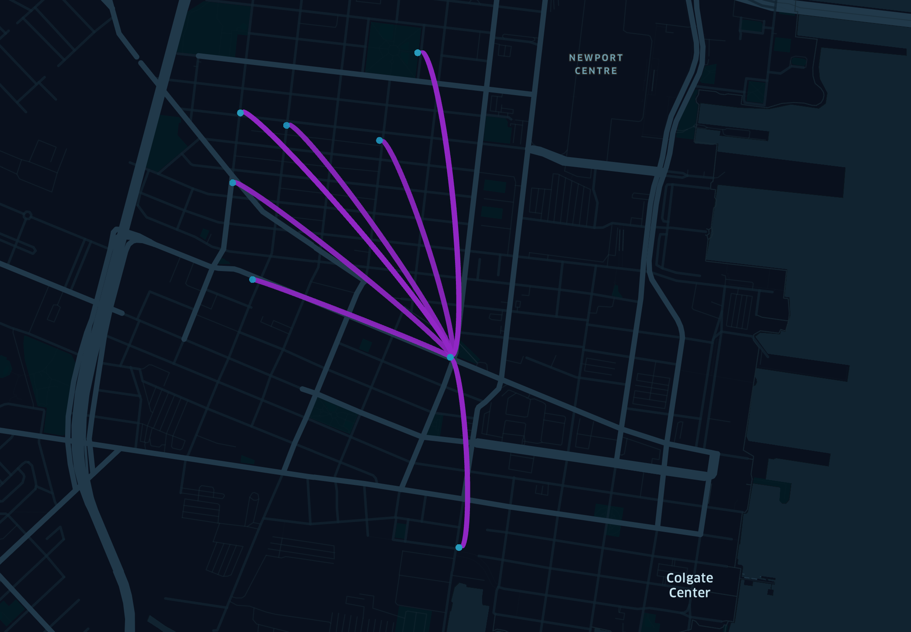

`Google Bigquery`, `Datastudio`, `Colab`의 환경에서 분석하고 최종적으로 주요 지표에 대한 대시보드 구성. 평소 담당자의 추측/감각에 의존하여 운영하던 방식에서 벗어나 데이터 기반의 의사결정을 지원. 회원, 시간, 날짜, 기상, 지리적 조건, 매출, 하드웨어 수명 관리 등 데이터 기반의 영업(매출), 마케팅, 운영 위해 주요 지표를 선정하고 대시보드를 통해 내부 구성원에서 공유.

----
#### 다양한 지표 살펴보기
##### Riders per Age Group
##### Distribution of Riders per Hour of the Day (weekdays)
##### Median Age per Departure Station
##### Rides by Hour of the Day
##### Duration Minutes
##### Trips Between Manhattan and Outer Boroughs
##### Temperature vs Daily Usage
##### Precipitation vs Daily Usage
##### Snow Depth vs Daily Usage


##### 총 trip의 수

```sql
SELECT COUNT(trip_id)
FROM FROM `bigquery-public-data.austin_bikeshare.bikeshare_trips` LIMIT 1000
```

| 행 | fO_     |
|----|---------|
| 1  | 1179147 |


##### 일자별 trip의 수
```sql
SELECT 
  DATE(start_time) AS date,
  COUNT(trip_id) AS count
FROM `bigquery-public-data.austin_bikeshare.bikeshare_trips`
GROUP BY date
ORDER BY date
```

| 행 | date       | count |
|----|------------|-------|
| 1  | 2013-12-21 | 103   |
| 2  | 2013-12-22 | 117   |

위 쿼리를 통해 추출한 데이터는 추가 작업 없이 `datastudio`에서 년, 월, 일별 시계열 차트로 분석이 가능

{: .center-image}

```python
import pandas as pd
import matplotlib
import matplotlib.pyplot as plt
from IPython.display import set_matplotlib_formats
import seaborn as sns

matplotlib.rc('font', family = 'AppleGothic')
set_matplotlib_formats('retina')
matplotlib.rc('axes', unicode_minus = False)
```

```python
query = """
 SELECT 
  DATETIME(start_time) AS date,
  COUNT(trip_id) AS count
FROM `bigquery-public-data.austin_bikeshare.bikeshare_trips`
GROUP BY date
ORDER BY date
"""
df = pd.read_gbq(query = query, project_id='******', dialect='standard')

df.head()
```

```python
df['year'] = df['date'].dt.year
df['month'] = df['date'].dt.month
df['day'] = df['date'].dt.day
df['hour'] = df['date'].dt.hour

plt.figure(figsize = [25, 8])
sns.pointplot(data = df, x = 'month', y = 'count', hue = 'year')
```

{: .center-image}


##### subscriber_type별 Trip Count

```sql
SELECT 
  subscriber_type,
  COUNT(trip_id) AS count
 FROM `bigquery-public-data.austin_bikeshare.bikeshare_trips`
 GROUP BY subscriber_type
 ORDER BY count DESC
 ```

{: .center-image}

##### 시작 station과 도착 station별 Trip Count(Most Popular Roads)
```sql
SELECT 
  start_station_id,
  end_station_id,
  COUNT(trip_id) AS trip_cnt
FROM `bigquery-public-data.austin_bikeshare.bikeshare_trips`
GROUP BY start_station_id, end_station_id
ORDER BY trip_cnt DESC
```

| 행 | start_station_id | end_station_id | trip_cnt |
|----|------------------|----------------|----------|
| 1  | 3798             | 3798           | 13164    |
| 2  | 2575             | 2575           | 12465    |

```python
table = pd.pivot_table(raw_data, 
                       index = ['start station id', 'end station id'], 
                       values = 'Age', 
                       fill_value = 0, 
                       aggfunc = len)

table.columns = ['total']
table = table.sort_values(by = 'total', ascending = False)

table.head(10)
```

`start station latitude`, `start station longitude`, `end station latitude`, `end station longitude` 정보를 추가하여 상위 10개 구간 Trip Count에 대한 지리 정보 시각화

{: .center-image}


##### 시간대 별 Trip Count
```sql
SELECT start_hour, COUNT(trip_id) as cnt
FROM (
  SELECT EXTRACT(hour FROM start_time) AS start_hour, *
  FROM `bigquery-public-data.austin_bikeshare.bikeshare_trips`
)
GROUP BY start_hour
ORDER BY cnt DESC
```

```sql
SELECT start_hour, COUNT(trip_id) as cnt
FROM (
  SELECT DATETIME_TRUNC(DATETIME(start_time), hour) AS start_hour, *
  FROM `bigquery-public-data.austin_bikeshare.bikeshare_trips`
)
GROUP BY start_hour
ORDER BY cnt DESC
```

##### 요일별 Trip Count
```sql
SELECT weekday, COUNT(trip_id) AS count
FROM (
  SELECT FORMAT_DATETIME("%u", DATETIME(start_time)) AS weekday,
  *
  FROM `bigquery-public-data.austin_bikeshare.bikeshare_trips` 
  )
 GROUP BY weekday
 ORDER BY count desc
 ```


##### 요일/시간대별 Trip Count
```sql
SELECT weekday, start_hour, COUNT(trip_id) AS count
FROM (
  SELECT DATETIME_TRUNC(DATETIME(start_time), hour) AS start_hour,
  FORMAT_DATETIME("%u", DATETIME(start_time)) AS weekday,
  *
  FROM `bigquery-public-data.austin_bikeshare.bikeshare_trips` 
  )
 GROUP BY weekday, start_hour
 ORDER BY count desc
 ```

##### Quiz 1
Are more bike trips were taken by subscribers or non-subscribers("Customers")? How does this compare to the **total trips started at each station?**

Below is a preview of `trip` table.

```sql
SELECT
  start_station,
  subscription_type,
  COUNT(start_date) AS trips,
  (SELECT COUNT(start_date)
    FROM trip AS t1
    WHERE t.start_station =
          t1.start_station) AS station_total
FROM trip AS t
GROUP BY start_station, subscription_type
ORDER BY start_station
LTMIT 3;
```

##### Quiz 2
Can you calculate a running total of minutes spent on bicycle `trips` per day?  
Below is a preview of `trips` table

| duration | start_date | start_station |
|----------|------------|---------------|
| 298      | 8/29/13    | 5th at Ho     |
| 431      | 9/29/13    | South Van     |

```sql
SELECT
  start_station,
  start_date,
  duration,
  SUM(duration) OVER (ORDER BY start_date
          ROWSBETWEEN UNBOUNDED PRECEDING
          AND CURRENT ROW) AS running_total
FROM trips
LIMIT 5;
```

| start_station | start_date | duration | running_total |
|---------------|------------|----------|---------------|
| South Van     | 2013-08-29 | 431      | 431           |
| 5th at How    | 2013-08-29 | 298      | 729           |


##### Quiz 3
Can you create a simple window function to calculate the overall count of bicycle docks at a station without grouping the result?  
Below is a preview of `station` table

| name       | docks |
|------------|-------|
| San Jose D | 27    |
| San Jose C | 15    |

```sql
SELECT
  name,
  docks,
  COUNT(docks) OVER() AS total_docks
FROM stations
LIMIT 2;
```

| name       | docks | total_docks |
|------------|-------|-------------|
| San Jose D | 27    | 70          |
| San Jose C | 15    | 70          |


참고 자료
- [A Tale of Twenty-Two Million Citi Bike Rides: Analyzing the NYC Bike Share System](https://toddwschneider.com/posts/a-tale-of-twenty-two-million-citi-bikes-analyzing-the-nyc-bike-share-system/)
- [Using NYC Citi Bike Data to Help Bike Enthusiasts Find their Mates](https://medium.com/@clairekeser/using-nyc-citi-bike-data-to-help-bike-enthusiasts-find-their-mates-70a661c098f1)
- [Citi Bike in NYC Analysis in Winter 2014-2018](https://public.tableau.com/profile/nami.tokunaga8823#!/vizhome/citibikeAnalysis/citibikeAnalysis)