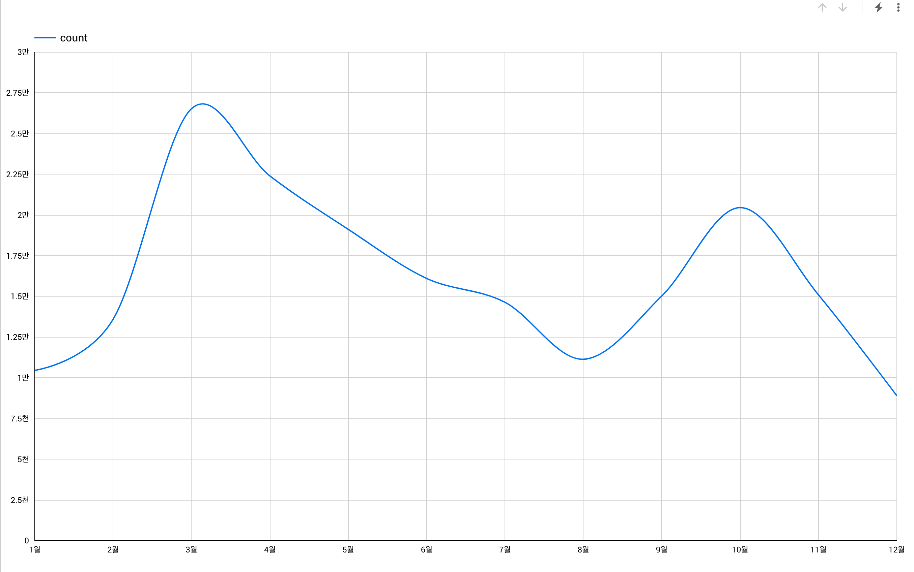
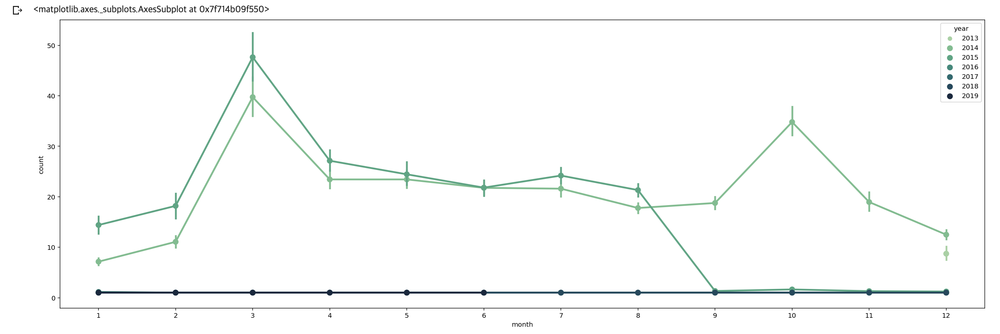
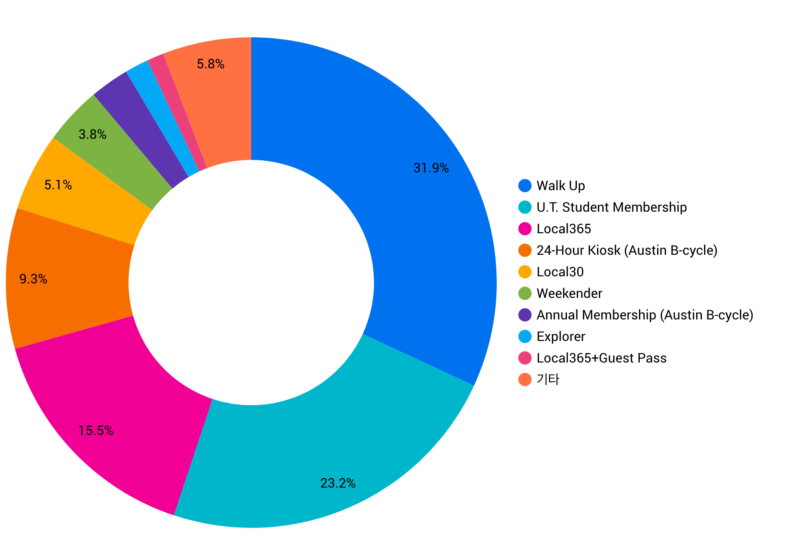

`Colab`, `Google Bigquery`, `Datastudio`의 환경에서 분석하고 대시보드 구성. 평소 궁금했거나 담당자의 추측/감각에 의존하여 운영하던 방식에서 벗어나 데이터 기반의 의사결정을 지원. (테스트 단계이므로)다양한 방법으로 추출해보고 회원, 시간, 날짜, 기상, 지리적 조건, 하드웨어 수명 관리 등 영업(매출 관리), 마케팅, 운영 관리를 위해 주요 지표를 선정하고 대시보드를 통해 내부 구성원에서 공유.

----

##### Problem: 심야 시간 가동률을 올리기 위하여 할인 이벤트 또는 가격 조정
##### 기존 방식 VS 데이터 기반의 의사 결정
##### Risk
  - 핵심가치인 '공유경제'의 확대와 무관하게 **심야 차량 수요를 새롭게 발굴해야함**
  - 운영 리스크: 도용, 보험, 사고, 고객 응대  

##### Solution 1: 동적 요금제 도입
##### Solution 2: 출/퇴근 요금제 도입

----

##### Riders per Age Group
##### Distribution of Riders per Hour of the Day (weekdays)
##### Median Age per Departure Station
##### Rides by Hour of the Day
##### Duration Minutes
##### Most Popular Roads
##### Trips Between Manhattan and Outer Boroughs
##### Temperature vs Daily Usage
##### Precipitation vs Daily Usage
##### Snow Depth vs Daily Usage


##### 총 trip의 수

```sql
SELECT COUNT(trip_id)
FROM FROM `bigquery-public-data.austin_bikeshare.bikeshare_trips` LIMIT 1000
```

| 행 | fO_     |
|----|---------|
| 1  | 1179147 |


##### 일자별 trip의 수
```sql
SELECT 
  DATE(start_time) AS date,
  COUNT(trip_id) AS count
FROM `bigquery-public-data.austin_bikeshare.bikeshare_trips`
GROUP BY date
ORDER BY date
```

| 행 | date       | count |
|----|------------|-------|
| 1  | 2013-12-21 | 103   |
| 2  | 2013-12-22 | 117   |

{: .center-image}

```python
import pandas as pd
import matplotlib
import matplotlib.pyplot as plt
from IPython.display import set_matplotlib_formats
import seaborn as sns

matplotlib.rc('font', family = 'AppleGothic')
set_matplotlib_formats('retina')
matplotlib.rc('axes', unicode_minus = False)
```

```python
query = """
 SELECT 
  DATETIME(start_time) AS date,
  COUNT(trip_id) AS count
FROM `bigquery-public-data.austin_bikeshare.bikeshare_trips`
GROUP BY date
ORDER BY date
"""
df = pd.read_gbq(query = query, project_id='******', dialect='standard')

df.head()
```

```python
import matplotlib.pyplot as plt
import seaborn as sns

df['year'] = df['date'].dt.year
df['month'] = df['date'].dt.month
df['day'] = df['date'].dt.day
df['hour'] = df['date'].dt.hour

plt.figure(figsize = [25, 8])
sns.pointplot(data = df, x = 'month', y = 'count', hue = 'year')
```

{: .center-image}


##### subscriber_type별 trip의 수

```sql
SELECT 
  subscriber_type,
  COUNT(trip_id) AS count
 FROM `bigquery-public-data.austin_bikeshare.bikeshare_trips`
 GROUP BY subscriber_type
 ORDER BY count DESC
 ```

{: .center-image}

##### 시작 station과 도착 station별 개수(제일 많은 구간은?)
```sql
SELECT 
  start_station_id,
  end_station_id,
  COUNT(trip_id) AS trip_cnt
FROM `bigquery-public-data.austin_bikeshare.bikeshare_trips`
GROUP BY start_station_id, end_station_id
ORDER BY trip_cnt DESC
```

| 행 | start_station_id | end_station_id | trip_cnt |
|----|------------------|----------------|----------|
| 1  | 3798             | 3798           | 13164    |
| 2  | 2575             | 2575           | 12465    |


##### 시간대 별 trip count
```sql
SELECT start_hour, COUNT(trip_id) as cnt
FROM (
  SELECT EXTRACT(hour FROM start_time) AS start_hour, *
  FROM `bigquery-public-data.austin_bikeshare.bikeshare_trips`
)
GROUP BY start_hour
ORDER BY cnt DESC
```

```sql
SELECT start_hour, COUNT(trip_id) as cnt
FROM (
  SELECT DATETIME_TRUNC(DATETIME(start_time), hour) AS start_hour, *
  FROM `bigquery-public-data.austin_bikeshare.bikeshare_trips`
)
GROUP BY start_hour
ORDER BY cnt DESC
```

##### 무슨 요일에 제일 사용자가 많을까?
###### 요일별 시간대 패턴이 다를?까?
###### 요일마다 제일 count가 많은 시간대는 어떻게 구해야 할까?
##### 제일 많이 운행한 bikeid?
##### 제일 오래 여행한 trip_id?
##### 제일 오래 여행한 여행은 몇시간 여행?


##### trip별 운행 시간의 total
##### bike별 운행 시간 total
##### bike별 운행 횟수, 평균까지 추가
##### start_station - end_station 별 토탈, 횟수, 평균
##### start_station_id, bikeid별 duration_minutes 많은 순
###### MAX값만 가져오기


##### start_station_id별 전후 duration_minutes


참고 자료
- [A Tale of Twenty-Two Million Citi Bike Rides: Analyzing the NYC Bike Share System](https://toddwschneider.com/posts/a-tale-of-twenty-two-million-citi-bikes-analyzing-the-nyc-bike-share-system/)
- [Using NYC Citi Bike Data to Help Bike Enthusiasts Find their Mates](https://medium.com/@clairekeser/using-nyc-citi-bike-data-to-help-bike-enthusiasts-find-their-mates-70a661c098f1)
- [Citi Bike in NYC Analysis in Winter 2014-2018](https://public.tableau.com/profile/nami.tokunaga8823#!/vizhome/citibikeAnalysis/citibikeAnalysis)