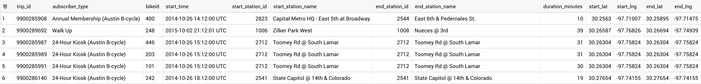

{: .center-image}

```sql
SELECT
  left_side.*,
  middle_side.latitude as start_lat, 
  middle_side.longitude as start_lng,
  right_side.latitude as end_lat,
  right_side.longitude as end_lng
FROM `bigquery-public-data.austin_bikeshare.bikeshare_trips` AS left_side
LEFT JOIN `bigquery-public-data.austin_bikeshare.bikeshare_stations` AS middle_side
  ON left_side.start_station_id = middle_side.station_id
LEFT JOIN `bigquery-public-data.austin_bikeshare.bikeshare_stations` AS right_side
  ON left_side.end_station_id = right_side.station_id
```
출발, 도착지의 지리 정보를 확인하기 위하여 Google bigquery-public-data의 `bikeshare_stations`와 `bikeshare_trips`
테이블을 start_station_id, end_station_id를 기준으로 `LEFT JOIN`한다. 각각의 trip에 출발, 도착 스테이션의 위도, 경도를 추가하여 최종적으로 아래와 같이 병합된다.  

{: .center-image}

Uber에서 제공하는 지리정보 시각화 도구인 kepler.gl을 이용하기 위하여 Google bigquery에서 CSV로 다운로드 후 kepler.gl에 CSV 파일을 업로드한다.
