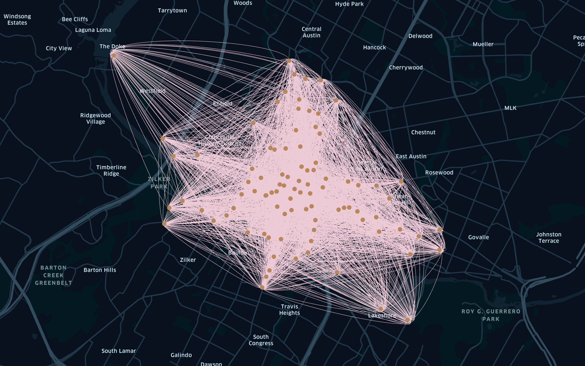

{: .center-image}

```sql
SELECT
  left_side.*,
  middle_side.latitude as start_lat, 
  middle_side.longitude as start_lng,
  right_side.latitude as end_lat,
  right_side.longitude as end_lng
FROM `bigquery-public-data.austin_bikeshare.bikeshare_trips` AS left_side
LEFT JOIN `bigquery-public-data.austin_bikeshare.bikeshare_stations` AS middle_side
  ON left_side.start_station_id = middle_side.station_id
LEFT JOIN `bigquery-public-data.austin_bikeshare.bikeshare_stations` AS right_side
  ON left_side.end_station_id = right_side.station_id
```

