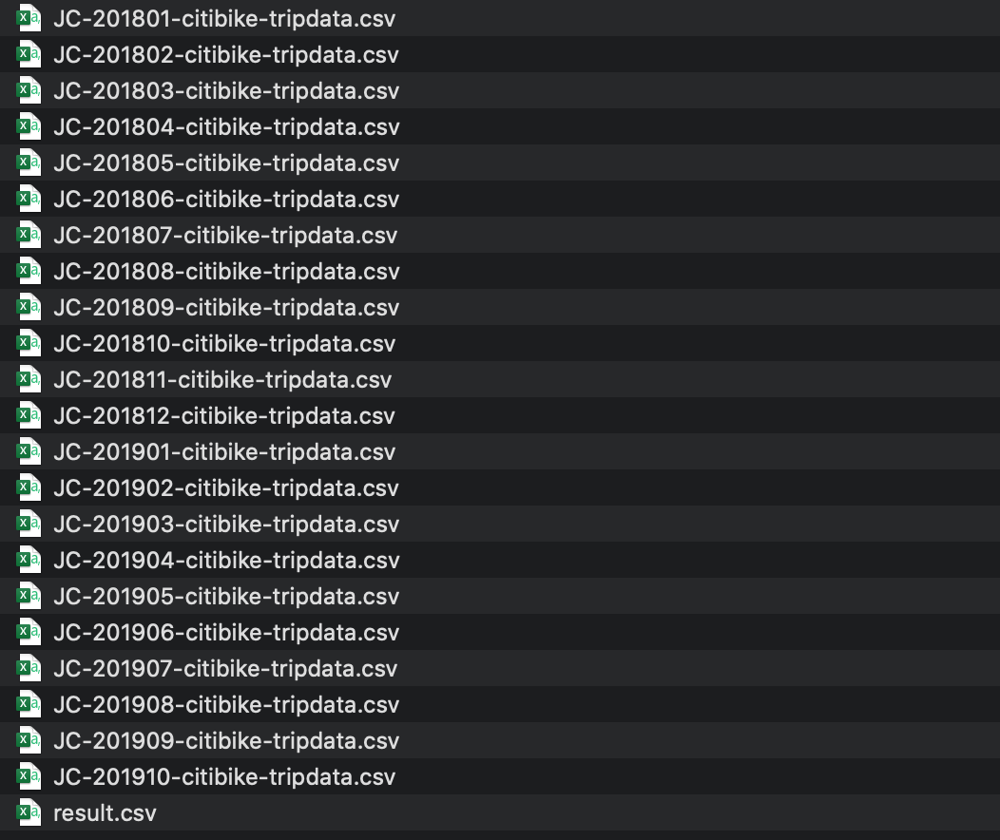

{: .center-image}

#### 데이터 준비하기(Google Bigquery)
```sql
SELECT
  left_side.*,
  middle_side.latitude as start_lat, 
  middle_side.longitude as start_lng,
  right_side.latitude as end_lat,
  right_side.longitude as end_lng
FROM `bigquery-public-data.austin_bikeshare.bikeshare_trips` AS left_side
LEFT JOIN `bigquery-public-data.austin_bikeshare.bikeshare_stations` AS middle_side
  ON left_side.start_station_id = middle_side.station_id
LEFT JOIN `bigquery-public-data.austin_bikeshare.bikeshare_stations` AS right_side
  ON left_side.end_station_id = right_side.station_id
```
각 trip별 출발, 도착지의 지리 정보를 확인하기 위하여 Google bigquery-public-data의 `bikeshare_stations`와 `bikeshare_trips` 테이블을 start_station_id, end_station_id를 기준으로 `LEFT JOIN`한다. 각각의 trip에 출발, 도착 스테이션의 위도, 경도를 추가하여 최종적으로 아래와 같이 병합된다.  

{: .center-image}

#### 데이터 준비하기(Colab/Jupyter Notebook)
```python
# Colab에 local 파일 업로드
from google.colab import files
uploaded = files.upload()

for fn in uploaded.keys():
  print('User uploaded file "{name}" with length {length} bytes'.format(name = fn, length = len(uploaded[fn])))
```

```python
import pandas as pd
import glob
import os.path

# 디렉토리 내 위치한 파일을 병합하고 저장
input_file = r'C:/Users/******' # csv파일이 있는 디렉토리 위치
output_file = r'C:/Users/******/raw_data.csv' # 병합하고 저장하려는 파일명

file_list = glob.glob(os.path.join(input_file, 'JC-20*')) 
print(file_list)

allData = [] 

for file in file_list:
    df = pd.read_csv(file) # for구문으로 csv파일들을 읽어 들인다
    allData.append(df) # 빈 리스트에 읽어 들인 내용을 추가한다

raw_date = pd.concat(allData, axis=0, ignore_index=True) # 리스트의 내용을 병합
raw_data.to_csv(output_file, index=False) # to_csv함수로 파일 저장
```

{: .center-image}

#### 지리데이터 시각화(kepler.gl)
Uber에서 제공하는 지리 정보 시각화 도구인 kepler.gl을 이용하기 위하여 Google bigquery에서 CSV로 다운로드 후 kepler.gl에 CSV 파일을 업로드한다.
