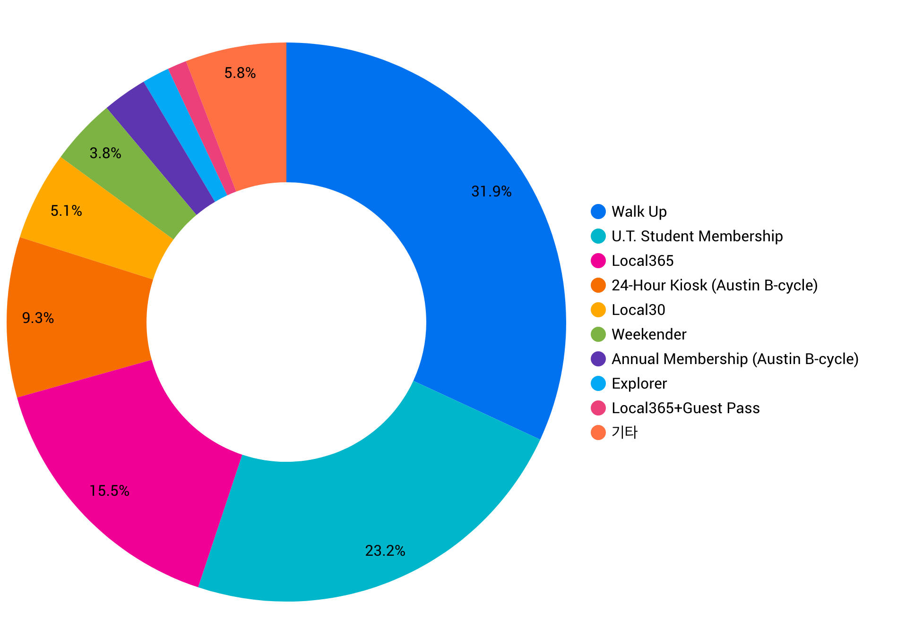

`Colab`, `Google Bigquery`, `Datastudio`의 환경에서 분석하고 최종 대쉬보드는 `Redash`로 구현. 평소 궁금했거나 담당자의 추측/감각에 의존하여 운영하던 방식에서 벗어나 데이터 기반의 의사결정을 지원. (테스트 단계이므로)다양한 방법으로 추출해보고 회원, 시간, 날짜, 기상, 지리적 조건, 하드웨어 수명 관리 등 영업(매출 관리), 마케팅, 운영 관리를 위해 주요 지표를 선정하고 대시보드를 통해 내부 구성원에서 공유.

##### 기존 의사 결정 방식
- 심야 시간에는 가동율이 낮으니 가동율을 높이기 위해 할인 이벤트 진행 
- 봄에는 비교적 전체 대여율 및 장기 대여율이 높은 것 같은데 할인 이벤트 진행


1. 주요 KPI 설정하고 정렬하기
    - 가동률
2. 대쉬보드 구축

##### 총 trip의 수

```sql
SELECT COUNT(trip_id)
FROM FROM `bigquery-public-data.austin_bikeshare.bikeshare_trips` LIMIT 1000
```

| 행 | fO_     |
|----|---------|
| 1  | 1179147 |


##### 일자별 trip의 수
```sql
SELECT 
  DATE(start_time) AS date,
  COUNT(trip_id) AS count
FROM `bigquery-public-data.austin_bikeshare.bikeshare_trips`
GROUP BY date
ORDER BY date
```

| 행 | date       | count |
|----|------------|-------|
| 1  | 2013-12-21 | 103   |
| 2  | 2013-12-22 | 117   |

{: .center-image}


##### subscriber_typr별 trip의 수

```sql
SELECT 
  subscriber_type,
  COUNT(trip_id) AS count
 FROM `bigquery-public-data.austin_bikeshare.bikeshare_trips`
 GROUP BY subscriber_type
 ORDER BY count DESC
 ```

{: .center-image}

##### 시작 station과 도착 station별 개수(제일 많은 구간은?)
```sql
SELECT 
  start_station_id,
  end_station_id,
  COUNT(trip_id) AS trip_cnt
 FROM `bigquery-public-data.austin_bikeshare.bikeshare_trips`
 GROUP BY start_station_id, end_station_id
 ORDER BY trip_cnt DESC
```


##### 몇 시에 trip 시작하는 사용자가 많을까요/
###### hour만 추출해서 count
###### datetime에서 시간까지만 자르고 count
###### 2017년 1월 1일부터 시간대별 추세를 구하는 쿼리


##### 무슨 요일에 제일 사용자가 많을까?
###### 요일별 시간대 패턴이 다를?까?
###### 요일마다 제일 count가 많은 시간대는 어떻게 구해야 할까?
##### 제일 많이 운행한 bikeid?
##### 제일 오래 여행한 trip_id?
##### 제일 오래 여행한 여행은 몇시간 여행?


##### trip별 운행 시간의 total
##### bike별 운행 시간 total
##### bike별 운행 횟수, 평균까지 추가
##### start_station - end_station 별 토탈, 횟수, 평균
##### start_station_id, bikeid별 duration_minutes 많은 순
###### MAX값만 가져오기


##### start_station_id별 전후 duration_minutes


참고 자료
- [A Tale of Twenty-Two Million Citi Bike Rides: Analyzing the NYC Bike Share System](https://toddwschneider.com/posts/a-tale-of-twenty-two-million-citi-bikes-analyzing-the-nyc-bike-share-system/)
- [Using NYC Citi Bike Data to Help Bike Enthusiasts Find their Mates](https://medium.com/@clairekeser/using-nyc-citi-bike-data-to-help-bike-enthusiasts-find-their-mates-70a661c098f1)
- [Citi Bike in NYC Analysis in Winter 2014-2018](https://public.tableau.com/profile/nami.tokunaga8823#!/vizhome/citibikeAnalysis/citibikeAnalysis)