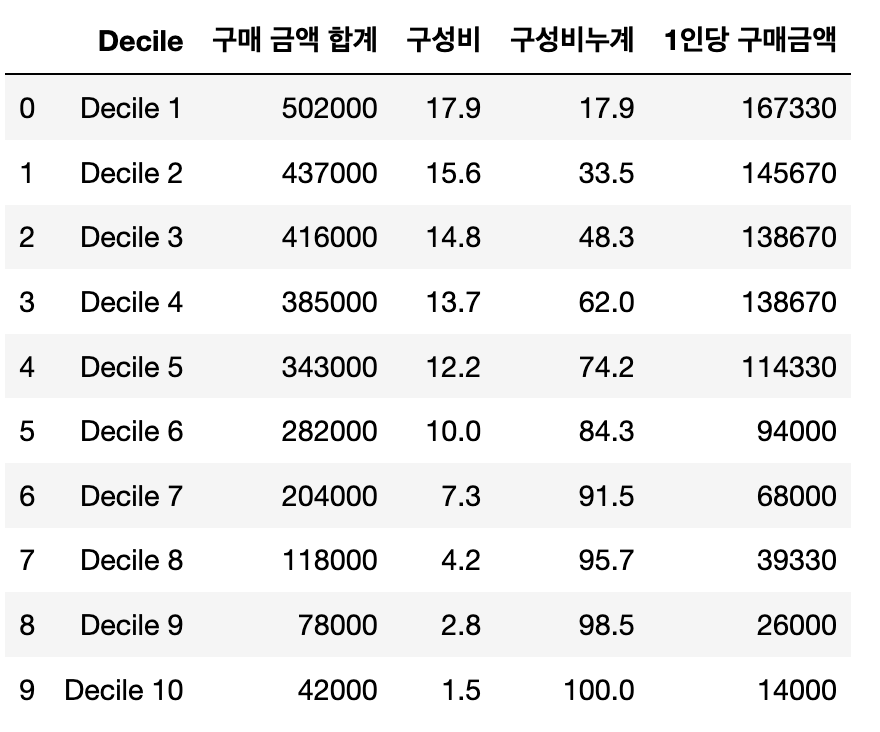
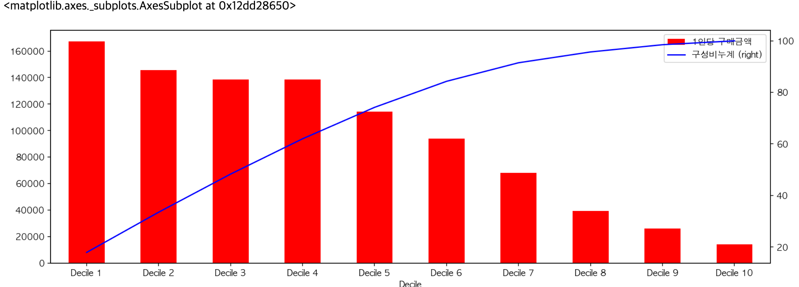

데이터를 10단계로 분할해서 중요도를 파악하는 `Decile 분석` 진행. 사용자를 구매 금액이 많은 순서로 정렬하고, 정렬된 사용자의 상위에서 10%씩 `Decile 1`부터 `Decile 10`까지 그룹을 할당. 같은 수로 그룹을 만들 때는 `NTILE` 윈도 함수를 사용.

#### Decile 분석 과정
1. 사용자를 구매 금액이 많은 순으로 정렬
2. 정렬된 사용자 상위부터 10%씩 Decile 1부터 Decile 10까지 그룹 할당
3. 각 그룹의 구매 금액 합계를 집계
4. 전체 구매 금액에 대해 각 Decile의 구매 금액 비율(구성비)를 계산
5. 상위에서 누적으로 어느 정도의 비율을 차지하는지 구성비누계를 집계

#### 활용
- Decile 7~10은 정착되지 않는 고객을 나타내는 것으로 해석 가능. 따라서 이메일 마케팅 등으로 리텐션을 높이는 마케팅이 가능하며, 해당 마케팅 시 추가적인 데이터를 수집해서 Decile 7 ~10에 해당하는 고객의 속성과 관련된 데이터를 더 수집하고 활용 가능
- Decile 분석은 데이터 검색 기간에 따라 문제가 될 수 있음. 예로 검색 기간이 너무 장기간이면 과거에는 우수 고객이었어도, 현재는 다른 서비스를 사용하는 휴먼 고객이 포함될 수 있음
- 반대로 검색 대상이 단기간이라면 정기적으로 구매하는 안정 고객이 포함되지 않고, 해당 기간 동안에서 일시적으로 많이 구매한 사용자가 우수 고객으로 취급될 수 있음
- `RFM` 분석을 통하여 `Decile` 분석보다 자세하게 사용자를 그룹으로 나눌 수 있음

#### 구매액이 많은 순서로 사용자 그룹을 10등분
```sql
WITH
user_purchase_amount AS (
    SELECT
        user_id,
        SUM(amount) AS purchase_amount
    FROM
        action_log
    WHERE
        action = 'purchase'
    GROUP BY
        user_id
),
users_with_decile AS (
    SELECT
        user_id,
        purchase_amount,
        ntile(10) OVER (ORDER BY purchase_amount DESC) AS decile
    FROM user_purchase_amount
)
SELECT *
FROM users_with_decile
```

#### 10분할한 Decile들을 집계
```sql
WITH
user_purchase_amount AS (
    SELECT
        user_id,
        SUM(amount) AS purchase_amount
    FROM
        action_log
    WHERE
        action = 'purchase'
    GROUP BY
        user_id
),
users_with_decile AS (
    SELECT
        user_id,
        purchase_amount,
        ntile(10) OVER (ORDER BY purchase_amount DESC) AS decile
    FROM user_purchase_amount
)
decile_with_purchase_amount AS (
    SELECT
        decile,
        SUM(purchase_amount) AS amount,
        AVG(purchase_amount) AS avg_amount,
        SUM(SUM(purchase_amount)) OVER (ORDER BY decile) AS cumulative_amount,
        SUM(SUM(purchase_amount)) OVER () AS total_amount
    FROM users_with_decile
    GROUP BY decile
)
SELECT *
FROM decile_with_purchase_amount
```

#### 구매액이 많은 Decile 순서로 구성비와 구성비누계를 계산
```sql
WITH
user_purchase_amount AS (
    SELECT
        user_id,
        SUM(amount) AS purchase_amount
    FROM
        action_log
    WHERE
        action = 'purchase'
    GROUP BY
        user_id
),
users_with_decile AS (
    SELECT
        user_id,
        purchase_amount,
        ntile(10) OVER (ORDER BY purchase_amount DESC) AS decile
    FROM user_purchase_amount
)
decile_with_purchase_amount AS (
    SELECT
        decile,
        SUM(purchase_amount) AS amount,
        AVG(purchase_amount) AS avg_amount,
        SUM(SUM(purchase_amount)) OVER (ORDER BY decile) AS cumulative_amount,
        SUM(SUM(purchase_amount)) OVER () AS total_amount
    FROM users_with_decile
    GROUP BY decile
)
SELECT
    decile,
    amount,
    avg_amount,
    100.0*amount / total_amount AS total_ratio,
    100.0*cumulative_amount / total_amount AS cumulative_ratio
FROM decile_with_purchase_amount
```

#### 시각화하기
```python
ax = df[['Decile', '1인당 구매금액']].plot(x = 'Decile', 
                                            kind = 'bar', 
                                            color = 'red')

df[['Decile', '구성비누계']].plot(x = 'Decile', 
                                    secondary_y=True, 
                                    ax = ax, 
                                    xlim=ax.get_xlim(),
                                    figsize = [15, 5], 
                                    color = 'red')
```

{: .center-image}
{: .center-image}