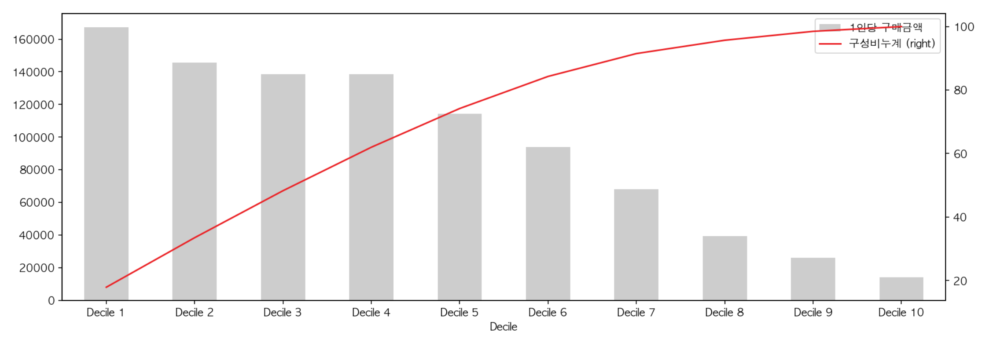

데이터를 10단계로 분할해서 중요도를 파악하는 `Decile 분석` 진행. 사용자를 구매 금액이 많은 순서로 정렬하고, 정렬된 사용자의 상위에서 10%씩 `Decile 1`부터 `Decile 10`까지 그룹을 할당. 같은 수로 그룹을 만들 때는 `NTILE` 윈도 함수를 사용.

1. 사용자를 구매 금액이 많은 순으로 정렬
2. 정렬된 사용자 상위부터 10%씩 Decile 1부터 Decile 10까지 그룹 할당
3. 각 그룹의 구매 금액 합계를 집계
4. 전체 구매 금액에 대해 각 Decile의 구매 금액 비율(구성비)를 계산
5. 상위에서 누적으로 어느 정도의 비율을 차지하는지 구성비누계를 집계

#### 구매액이 많은 순서로 사용자 그룹을 10등분
```sql
WITH
user_purchase_amount AS (
    SELECT
        user_id,
        SUM(amount) AS purchase_amount
    FROM
        action_log
    WHERE
        action = 'purchase'
    GROUP BY
        user_id
),
users_with_decile AS (
    SELECT
        user_id,
        purchase_amount,
        ntile(10) OVER (ORDER BY purchase_amount DESC) AS decile
    FROM user_purchase_amount
)
SELECT *
FROM users_with_decile
```

#### 10분할한 Decile들을 집계
```sql
WITH
user_purchase_amount AS (
    SELECT
        user_id,
        SUM(amount) AS purchase_amount
    FROM
        action_log
    WHERE
        action = 'purchase'
    GROUP BY
        user_id
),
users_with_decile AS (
    SELECT
        user_id,
        purchase_amount,
        ntile(10) OVER (ORDER BY purchase_amount DESC) AS decile
    FROM user_purchase_amount
)
decile_with_purchase_amount AS (
    SELECT
        decile,
        SUM(purchase_amount) AS amount,
        AVG(purchase_amount) AS avg_amount,
        SUM(SUM(purchase_amount)) OVER (ORDER BY decile) AS cumulative_amount,
        SUM(SUM(purchase_amount)) OVER () AS total_amount
    FROM users_with_decile
    GROUP BY decile
)
SELECT *
FROM decile_with_purchase_amount
```

#### 구매액이 많은 Decile 순서로 구성비와 구성비누계를 계산
```python
ax = df[['Decile', '1인당 구매금액']].plot(x = 'Decile', kind = 'bar', color = 'red')
df[['Decile', '구성비누계']].plot(x = 'Decile', secondary_y=True, ax = ax, figsize = [15, 5], color = 'blue', xlim=ax.get_xlim())
```

{: .center-image}
{: .center-image}