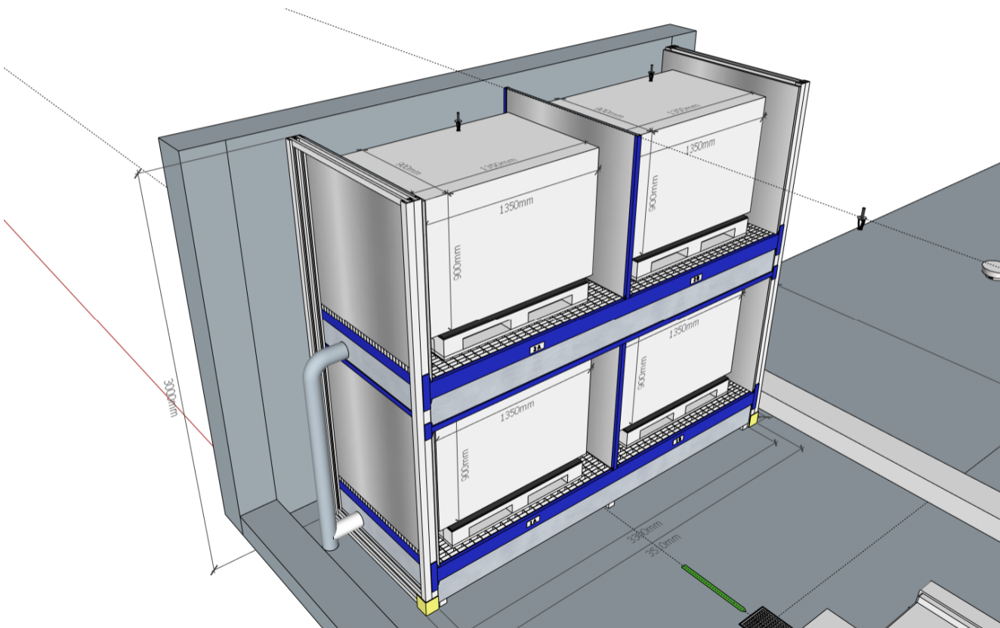
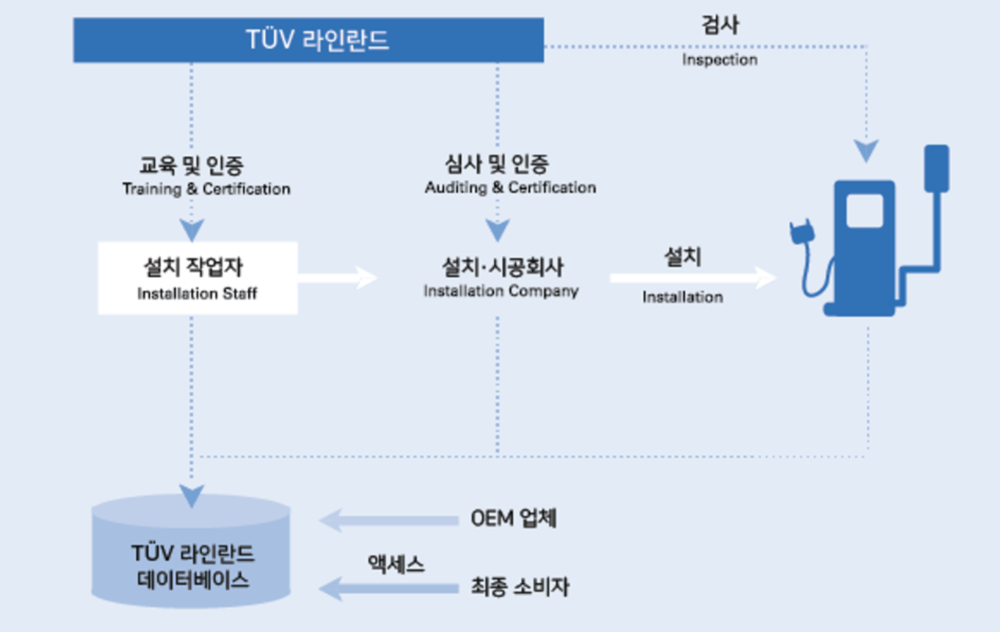

#### 1. LG 화학도 ESS 화재 확산 방지 시스템 준비, '스프링쿨러 장착'
- [관련기사: LG화학도 ESS 화재 확산 방지 시스템 준비…'스프링클러' 장착](https://www.etnews.com/20191104000307?m=1)
- 모듈별로 일종의 스프링쿨러를 장착
- 배터리 랙 근처에 별도 물탱크를 설치하고 랙 후면으로 각 모듈에 파이프를 연결한 후 연기나 열이 감지될 경우 물을 뿜어서 열폭주 방지
- 삼성SDI는 모듈 상단에 캡슐 형태 특수 소화 약품이 탑재된 부품을 장착하고 셀과 셀 사이에 열 확산 차단재를 삽입하는 방식

##### Comments(2016 프로젝트 기준)
- 리튬이온전지의 저장만을 위한 국제 규격은 현재 없음
- 리튬이온전지의 보관과 관련하여 표준에서는 제조업체의 권장사항을 참조하도록 되어 있음
- 참고할 수 있는 배터리 저장 관련 표준
  - dangerous goods(see UN3480 for transport)
  - as component including dangerous substances
- 간접적 요구사항으로는 `화재예방(Fire Protection Act)`, `WHG(Water Management Act)`, `ArbSchG` 등이 있음
- 기술적 추천사항으로는 `건물구성`, `전기설비`, `바닥`, `방화문`, `폐수용기`, `화재감지 측정`, `화재완화시스템(스프링쿨러)` 등등

##### 설계도(2016년 기준)

{: .center-image}

최근에는 `제주 전기차 폐배터리 재사용 센터`, `BMW의 i3 폐배터리를 활용한 전기차 충전소`등이 진행되고 있는것 같다. 특히 BMW의 이고팡 프로젝트는 전기차 폐배터리 재활용의 현실적 대안을 잘 보여준 것 같다.
- [관련기사: BMW코리아, 제주서 폐배터리로 전기차 충전소 세웠다](http://it.chosun.com/site/data/html_dir/2019/08/12/2019081202263.html)
- [관련기사: 전기차 폐배터리 재활용…제주도, 시장 선점 잰걸음](https://www.msn.com/ko-kr/news/national/%EC%A0%84%EA%B8%B0%EC%B0%A8-%ED%8F%90%EB%B0%B0%ED%84%B0%EB%A6%AC-%EC%9E%AC%ED%99%9C%EC%9A%A9%E2%80%A6%EC%A0%9C%EC%A3%BC%EB%8F%84-%EC%8B%9C%EC%9E%A5-%EC%84%A0%EC%A0%90-%EC%9E%B0%EA%B1%B8%EC%9D%8C/ar-BBVc3gH)

#### 2. SK 스피드메이트, 전기차 정비 역량 강화 위해 TUV라인란드와 MOU
- [SK 스피드메이트, 전기차 정비 역량 강화 위해 TUV라인란드와 MOU](https://www.etnews.com/20191104000307?m=1)
- 전기차 운영과 관련된 고전압 안전교육
- 전기차 정비 작업 및 배터리/충전설비 관리에 대한 정보와 지식을 교환하며 지속적인 협력 유지

##### Comments
- 위 전기차 고전압안전교육은 BGI-8686에 따라 TUV SUD, TUV Rheinland 등의 인증 기관에서 시행하는 자격제도로 Level 1, Level 2, Level 3로 구성되어 있으며 해외 일부 제조사의 경우 해당 자격증 취득자만이 고전압 차량의 정비 등을 수행할 수 있다고 한다.
- 세부 Level에 따라 이론, 이론+실습, 비활전 또는 활전 상태의 정비 가능 여부 등이 구분되며 Level 1은 1일, Level 2는 3일, Level 3는 7일 정도 소요된다. 불과 1-2년 전까지도 중국, 독일 현지 강사 등을 초빙하여 진행하였으나 최근 국내 관계자가 강의를 진행할 수 있는 자격을 획득 함으로써 기간, 비용 등이 많이 감축된 것으로 확인된다.(당시에는 국내 대기업 관계자들 모두 중국인 강사에게 교육 받고 시험을 치뤘다.)
- 당시 플랫폼 사업자로써 고전압 안전교육이라는 사이드 프로젝트와 별개로 사업적 중요 인증은 `EVSE Installation Validation` 이었는데, 복잡하고 어려운 전기차 충전기 설치, 운영을 모바일 기반으로 접수, 설치, 검사, 운영하는 것이 목표였다. 다수의 `공급자`를 관리하고 플랫폼의 `전문가`가 `높은 수준의 서비스를 제공하는 것이 주요했다.(e.g. 집닥)
- 아쉬운 점은 충전인프라 설치, 운영, 유지보수 등에서는 아직도 제대로된 서비스를 찾기 어려운데 저가 입찰 방식, 정부 주도의 정책 등이 주요한 이유로 보이며 다행히 최근에는 `GS칼텍스 충전인프라`, `현대차 하이차저` 등 변화의 움직임을 확인할 수 있다.

##### EVSE Installation Validation
{: .center-image