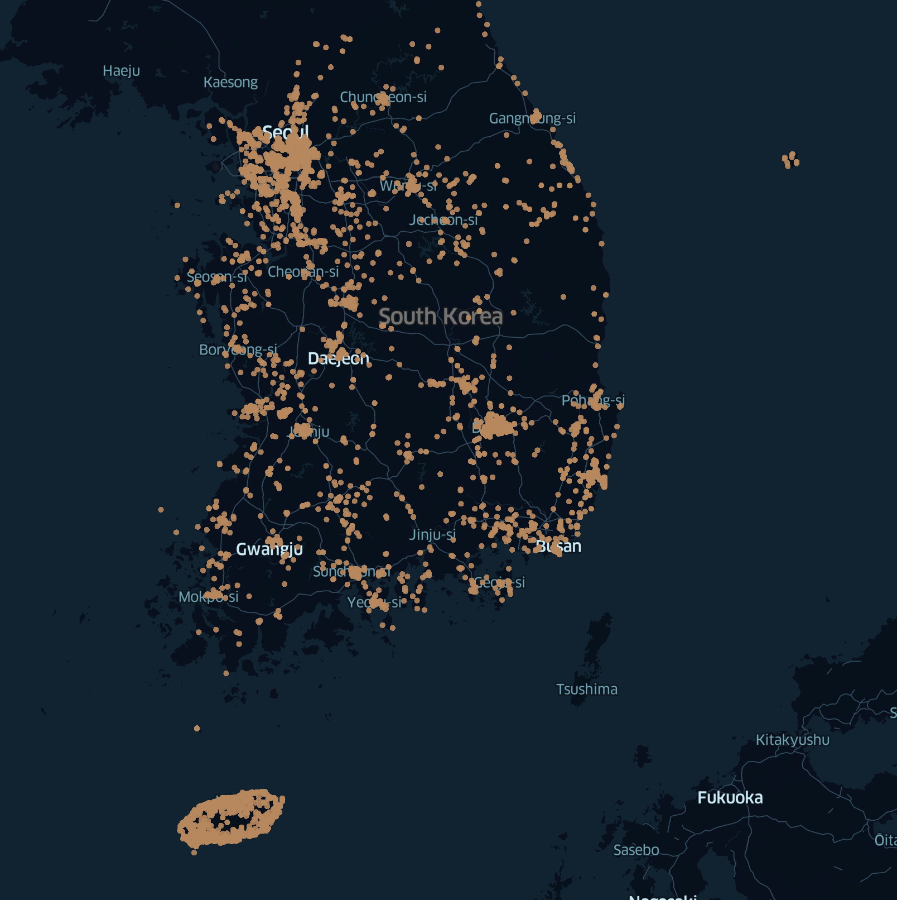

{: .center-image}

데이터 분석에 앞서 다음은 공공데이터 활용 및 품질관리 실태에 대한 한국환경공단에 대한 감사원의 19년 2월 감사보고서이다.
> 한국환경공단 이사장은 전기자동차 사용자가 충전소를 이용하는 데 불편함이 없도록 앞으로 전기자동차 충전소 입지 선정에 행정안전부의 공공 빅데이터 분석 모델을 활용하는 방안을 마련함과 아울러 위 공단에서 직접 설치한 충전소 1,252곳(충전기: 1,696대)과 8개 민간 충전사업자의 충전소 2,862곳(충전기: 4,219대)의 정보를 통합하여 개방을 확대하고, 충전 가능 여부 등 충전기의 실시간 상태 정보 제공 시, 실제 상태 정보와의 시차를 단축하는 방안을 마련하시기 바랍니다.(통보)

<mark>감사원의 자료에 따르면 기존 용역 결과에 따른 광역 교통량, 시군구 간 균형적인 설치를 고려하는 방식에서 보급 현황, 위치 및 사용률, 대중집합시설 및 주차장 정보 등 데이터를 융복합하여 분석하는 방식을 통하여 보다 효율적인 입지 선정을 추천</mark>

#### 데이터 수집하기
현재 충전인프라의 이용과 관련해서는 누적 데이터를 제공하지 않는 것으로 확인된다. 단지 충전기 상태에 대한 정보만 API로 제공하니 해당 API를 이용해서 데이터 수집을 진행할 예정이다. 제공되는 API를 통하여 받아온 정보를 10분단위로 CSV 저장 후 데이터 분석에 이용할 예정이다. 다만 이 방식은 데이터 수집에 너무 많은 시간이 소요된다는 점인데 여름/겨울의 전기차 배터리 성능은 기온, 히터, 저/고속 주행 여부 등에 따라 30%까지도 편차가 발생하는데 이러한 배터리 성능에 따른 충전 형태 분석을 위해서는 1년간 데이터 수집만 해야되는 상황이 발생한다. 한달 정도의 데이터 수집이 진행될 경우 일부 데이터 분석은 가능할 것이나 10분 단위로 충전기 상태만 받아올 경우 사용자에 대한 구분, 차량에 대한 구분 등 여러 아쉬운 점이 존재하는 것 같다.

#### 지역별 충전인프라 구축 현황

#### 시간별 사용 현황(기상, 휴일 정보 추가)

#### 요일별 사용 현황(기상, 휴일 정보 추가)

#### 설치 형태별 사용 현황 분황
##### 완속충전기 구축 효율성(지리 정보 추가)
##### 급속충전기 구축 효율성(지리 정보 추가)

#### 추가 과제
##### 설치 형태별 추천(빅데이터, 머신러닝?)
- 출발, 도착지를 기준으로 최적의 충전기 추천
  - 기존 충전기 이용 패턴, 고장 현황, 현재 차량 배터리 상태, 공휴일, 기상 상태 등등 고려 사항 검토
- 주거, 상업, 고속도로, 공공 등으로 구분...

