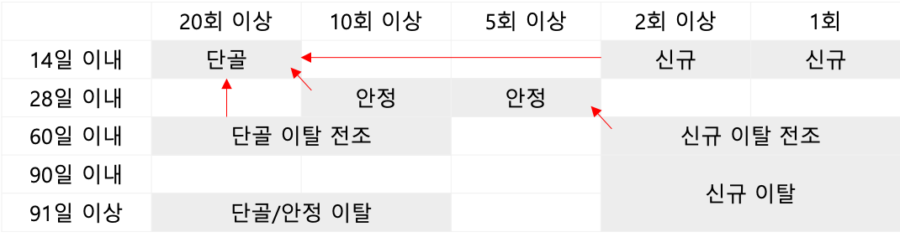
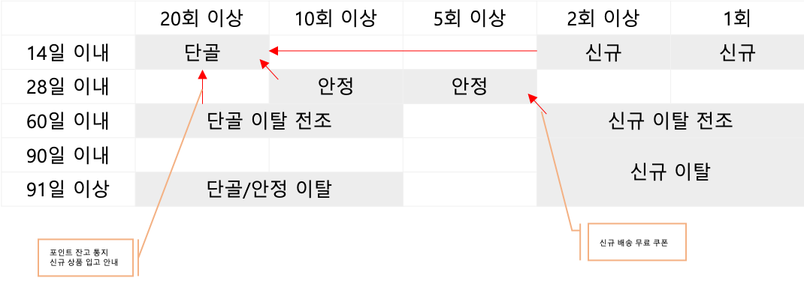

#### RFM 분석의 3가지 지표 집계하기
- Recency: 최근 구매일
- Frequency: 구매 횟수
- Monetary: 구매 금액 합계

#### 사용자별로 RFM을 집계하는 쿼리
```sql 
WITH
purchase_log AS (
    SELECT
        user_id,
        amount,
        -- 타임스탬프 기반 날짜 추출
        substr(stamp, 1, 10) AS dt
    FROM
        action_log
    WHERE 
        action_log = 'purchase'
),
user_rfm AS (
    SELECT
        user_id,
        MAX(dt) AS recent_date,
        date_diff(CURRENT_DATE, date(timestamp(MAX(dt))), day) AS recency,
        COUNT(dt) AS frequency,
        SUM(amount) AS monetary
    FROM
        purchase_log
    GROUP BY
        user_id
)
SELECT *
FROM user_rfm
```

#### RFM 랭크 정의
RFM 분석에서는 3개의 지표를 각각 5개의 그룹으로 나누는 것이 일반적으로 125개의 그룹으로 사용자를 나눠 파악할 수 있음

| 랭크 | R: 최근 구매일 | F: 누계 구매 횟수 | M: 누계 구매 금액 |
|------|----------------|-------------------|-------------------|
| 5    | 14일 이내      | 20회 이상         | 300만원 이상      |
| 4    | 28일 이내      | 10회 이상         | 100만원 이상      |
| 3    | 60일 이내      | 5회 이상          | 30만원 이상       |
| 2    | 90일 이내      | 2회 이상          | 5만원 이상        |
| 1    | 91일 이내      | 1회               | 5만원 미만        |

- 신규 고객
- 신규 우량 고객
- 안정 고객
- 우량 고객
- 비우량 고객
- 이탈 고객


{: .center-image}

{: .center-image}